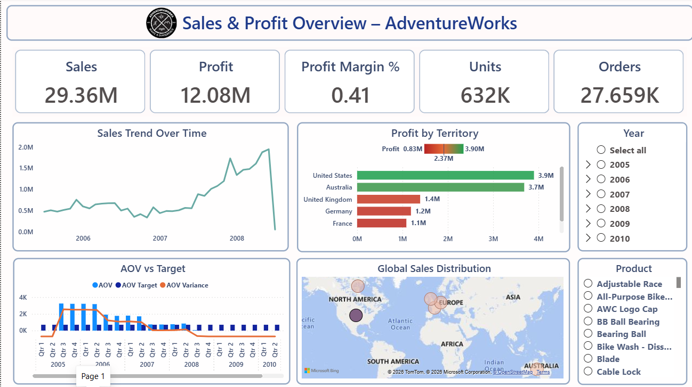
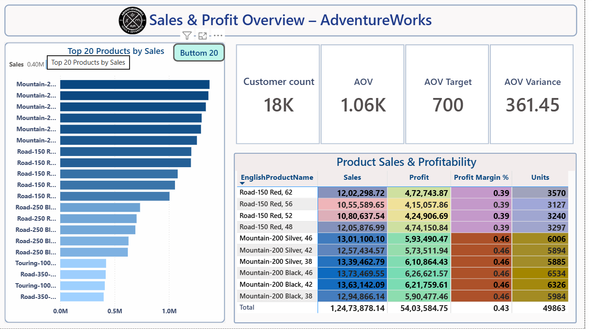

# 📈 AdventureWorks Sales Performance Dashboard

## 📌 About This Project

I developed this Power BI dashboard using the AdventureWorks sample dataset to analyze sales performance, profitability, customer behavior, and product performance.

The objective of this project was to transform transactional sales data into meaningful business insights through interactive dashboards and KPI reporting. It also helped me strengthen my skills in Power BI, DAX, data modeling, and business storytelling.

---

## 📸 Dashboard Preview

### 📄 Page 1 – Sales Overview

### 📄 Page 2 – Product Performance

---

## 🎯 Business Objective

This dashboard helps business users:

- Monitor overall sales performance
- Track profit and profit margin
- Analyze sales trends over time
- Compare sales across territories
- Evaluate Average Order Value (AOV)
- Identify top and bottom performing products
- Monitor customer performance
- Explore product profitability

---

## 📊 Dashboard Features

### Page 1 – Sales Overview

- Total Sales
- Total Profit
- Profit Margin %
- Units Sold
- Total Orders
- Sales Trend Analysis
- Profit by Territory
- Global Sales Distribution
- Product & Year Filters
- AOV vs Target Analysis

---

### Page 2 – Product Performance

- Top 20 Products
- Bottom 20 Products
- Customer Count
- Average Order Value
- Target vs Actual AOV
- Product Profitability Matrix
- Conditional Formatting
- Profit Margin Analysis

---

## 🛠️ Tools & Technologies

- Microsoft Power BI
- Power Query
- DAX
- Data Modeling

---

## 💡 Skills Demonstrated

- Sales Analytics
- Profitability Analysis
- KPI Development
- Interactive Dashboard Design
- DAX Calculations
- Data Modeling
- Conditional Formatting
- Business Intelligence Reporting

---

## 📂 Dataset

This dashboard uses the **AdventureWorks sample dataset** provided for learning and portfolio purposes.

---

## 📚 What I Learned

Working on this project helped me improve my understanding of:

- Sales analytics
- Product performance analysis
- Customer analytics
- KPI reporting
- Interactive dashboard design
- Business storytelling using Power BI

---

## 📁 Project Files

- 📄 AdventureWorks Sales Performance Dashboard.pbix
- 🖼️ dashboard-page1.png
- 🖼️ dashboard-page2.png
- 📘 README.md

---

## 👩‍💻 About Me

I have 3.5 years of professional experience in Procurement and SAP MM. After taking a career break, I have been upskilling in Data Analytics by learning Power BI, SQL, Advanced Excel, Python, Azure Data Factory, and Git.

I created this project as part of my portfolio to demonstrate my dashboard development and analytical skills.

I'm currently seeking opportunities as a Data Analyst or Power BI Developer.

---

Thank you for visiting my project!

If you found this project interesting, feel free to explore my other repositories.
